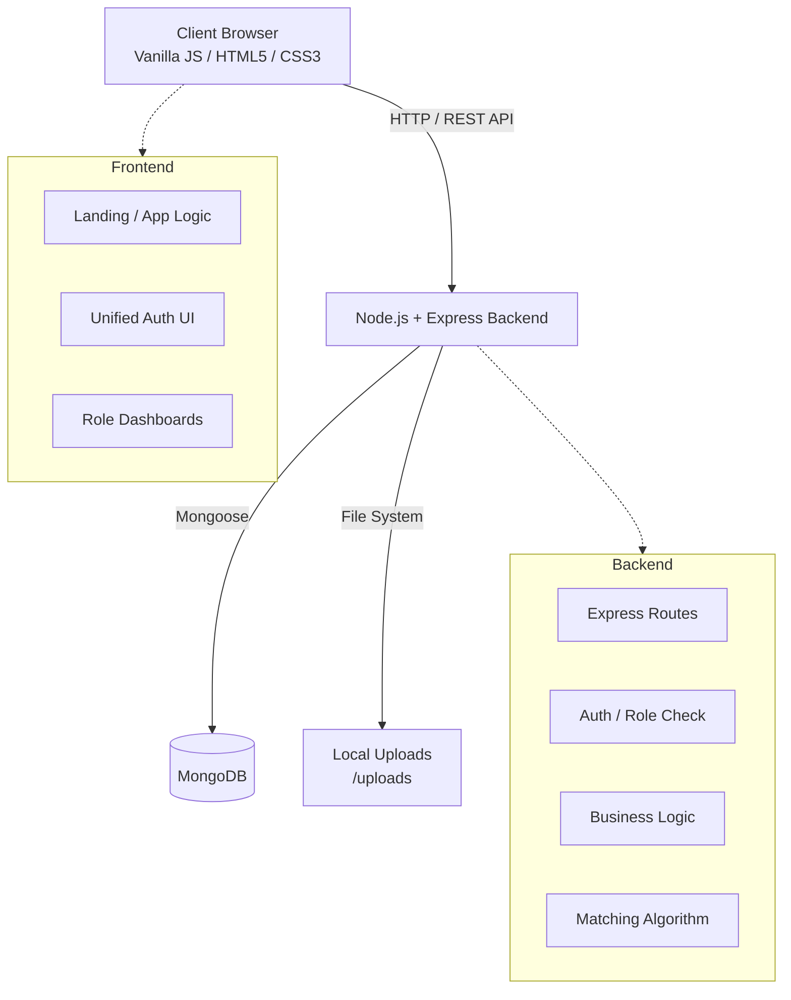
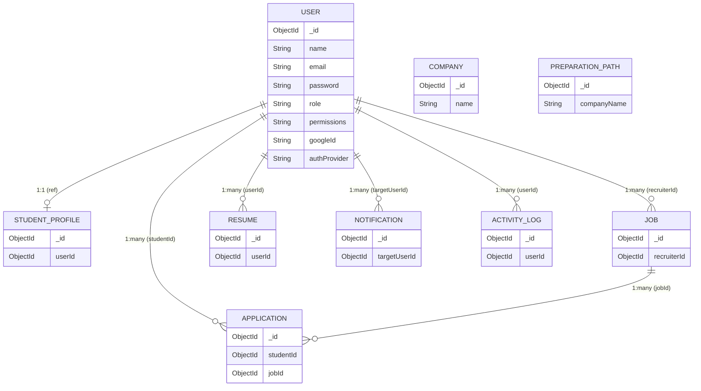
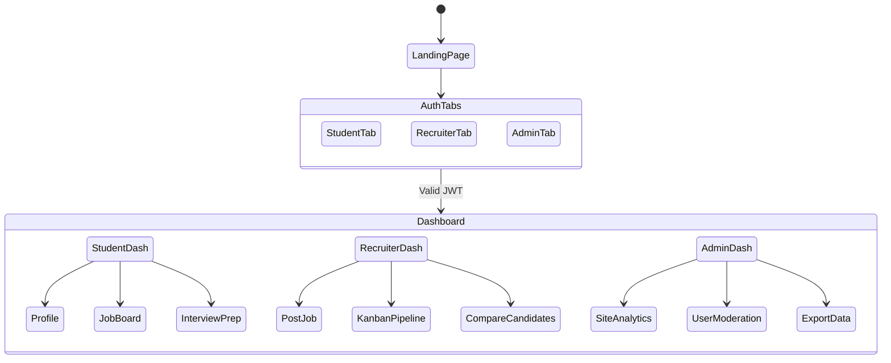

# HirePrep Technical Architecture

This document outlines the technical architecture, design patterns, database models, and application flows for the HirePrep platform.

## 1. High-Level Architecture

HirePrep is built as a monolithic client-server application consisting of a static frontend communicating with a Node.js/Express REST API backend. The persistence layer utilizes MongoDB.



## 2. Technology Stack

### Frontend
- **Core:** Vanilla HTML5, CSS3, JavaScript (ES6+)
- **Styling:** Custom CSS with CSS Variables, Inter font (Google Fonts)
- **Data Visualization:** Chart.js (loaded via CDN)
- **Deployment:** Static frontend + _redirects file for Netlify-style hosting

### Backend
- **Runtime & Framework:** Node.js, Express.js v4.21.0
- **Authentication:** JWT (jsonwebtoken v9.0.2), bcryptjs v2.4.3, Google OAuth (partial)
- **Security:** Helmet v7.1.0, express-rate-limit v7.1.5, express-validator v7.0.1
- **File Upload & Parsing:** Multer v1.4.5, pdf-parse v1.1.1
- **Logging:** Morgan v1.10.0
- **Environment & Dev:** dotenv v16.4.5, Nodemon v3.1.14

### Database
- **Primary Datastore:** MongoDB (MongoDB Atlas or local)
- **ODM:** Mongoose v8.5.0

## 3. Database Models & Relationships

The database relies on MongoDB with Mongoose schemas. Core entities revolve around the central `User` model, heavily utilizing document references to map out domain relations.



- **Company & PreparationPath**: Standalone collections. `Company` is referenced by name within jobs, and `PreparationPath` stores company-specific interview prep data.

## 4. Matching Algorithm

The platform features a proprietary candidate-to-job matching algorithm that evaluates applications based on specific weights to output a final Hiring Probability label.

**Formula:**
`Total Score = (Skill Match × 60%) + (Experience Score × 20%) + (Resume Completeness × 20%)`

- **Skill Match (60%):** Calculated based on the percentage of required job skills matched within the candidate's profile (using case-insensitive string inclusion).
- **Experience Score (20%):** Evaluates the candidate's years of experience against the job's required experience, capping out at 100 points.
- **Resume Completeness (20%):** Weighted check for the presence of key fields (education, projects, etc.), capping out at 100 points.
- **Final Output Labels:**
  - **High:** ≥ 70%
  - **Medium:** 40% - 69%
  - **Low:** < 40%

## 5. API Routes Summary

The backend acts as a pure REST API primarily serving JSON.

### Authentication (`/api/auth`)
- `POST /register`, `POST /login`, `POST /admin-login`, `POST /google`
- `GET /me`

### Profile & Resume (`/api/profile`, `/api/resume`)
- **Profile:** CRUD operations on student profiles, plus specific endpoints for skills (`POST /skills`, `DELETE /skills/:skillId`) and projects.
- **Resume:** `GET /`, `POST /`, `PUT /` (with file upload via `/api/profile/resume`).

### Jobs (`/api/jobs`)
- CRUD operations for jobs with search/filter/pagination on list endpoints.
- `GET /recruiter/my` (Recruiter-specific job list).

### Applications (`/api/applications`)
- Application pipeline and lifecycle management.
- Matching features: `GET /preview/:jobId` (preview score), `GET /job/:jobId/recommended` (auto-recommend), `POST /compare` (candidate comparison).
- Status updates: `PUT /:id/status`, `PUT /:id/interview`.

### Admin (`/api/admin`)
- Platform observability: `/stats`, `/analytics`, `/site-health`, `/db-status`.
- Moderation & Management: Users, Companies (`PUT /companies/:id/verify`), Bulk Notifications.
- Content Management: Exporting CSVs, viewing algorithm logs.

### Middleware Mechanisms
- `auth`: Decodes JWT from `Authorization: Bearer <token>`, attaches `user` to the request object.
- `roleCheck(...roles)`: Verifies the authenticated user's role against required roles (e.g., `admin`, `recruiter`, `student`).

## 6. Application Flows



### Detailed Flow Breakdowns
1. **Authentication Flow:** User visits landing page → Navigates to unified Auth Page → Selects role tab (Student/Recruiter/Developer) → Logs in or Registers → Receives JWT → Redirected to role-specific dashboard.
2. **Student Flow:** Login → View Dashboard (stats, matches) → Manage Profile → Browse Jobs → **Preview Match Score** → Apply → Prepare for Interviews (MCQs, Mocks, Company Paths) → Build Resume & Track Roadmap.
3. **Recruiter Flow:** Login → View Dashboard → Post new Jobs → Review Candidates in Kanban Pipeline → Compare Applicant Metrics → Schedule Interviews → Monitor Job Analytics.
4. **Admin Flow:** Login via secret key → View advanced analytics → Manage Users & Verify Companies → Configure bulk notifications → Monitor Site/DB Health.

## 7. Folder Structure (Highlights)

```text
hireprep-final/
├── .env, package.json, _redirects
├── index.html, team.html, docs.html
├── css/
│   └── style.css                 (CSS Variables)
├── js/
│   ├── api.js                    (API wrapper & Mock fallback)
│   ├── unified-auth.js           (Role-based Auth Tabs)
│   ├── student-*.js              (Student domain logic)
│   ├── recruiter-*.js            (Recruiter domain logic)
│   ├── admin.js, admin-panel.js  (Admin domain logic)
│   └── mcq-quiz.js, mock-test.js (Interview prep engines)
├── data/
│   └── questions.json            (Question bank & generation scripts)
├── frontend/                     (Role-specific HTML views)
│   ├── student/, recruiter/, admin/
└── server/
    ├── server.js                 (Express entry)
    ├── config/db.js              (MongoDB connection)
    ├── middleware/auth.js        (JWT & Roles)
    ├── models/                   (Mongoose schemas)
    ├── routes/                   (Express routers)
    ├── utils/matchingAlgorithm.js(Scoring logic)
    └── uploads/                  (Multer storage)
```
